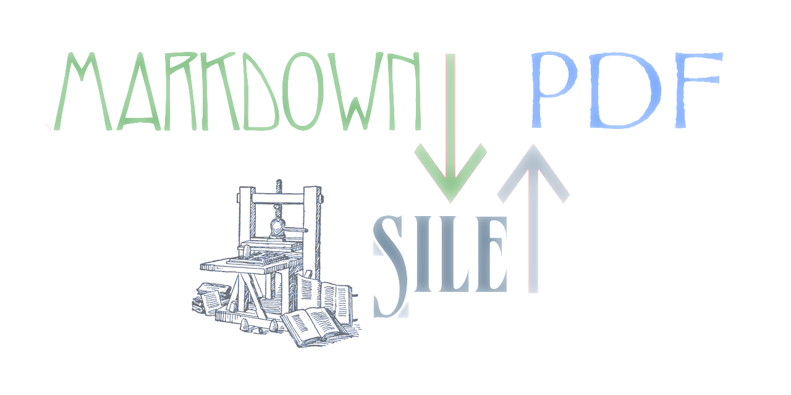

# markdown.sile


[](LICENSE)
[](https://github.com/Omikhleia/markdown.sile/actions?workflow=Luacheck)
[](https://luarocks.org/modules/Omikhleia/markdown.sile)

This collection of modules for the [SILE](https://github.com/sile-typesetter/sile) typesetting system provides a complete redesign of its former native Markdown support, with a great set of Pandoc-like extensions and plenty of extra goodies.

- **markdown** inputter and package: native support of Markdown files.
- **djot** inputter and package: native support of Djot files.
- **pandocast** inputter and package: native support of Pandoc JSON AST files.

For casual readers, this collection notably aims at easily converting Markdown or Djot documents to print-quality PDFs.

## Installation

This module collection requires SILE v0.14 or upper.

Installation relies on the **luarocks** package manager.

To install the latest version, you may use the provided “rockspec”:

```shell
luarocks install markdown.sile
```

(Refer to the SILE manual for more detailed 3rd-party package installation information.)

## Usage

Basic usage is described just below. A more complete PDF version of the documentation (but not necessarily the latest, see also further below for generating it from the sources) should be available [HERE](https://drive.google.com/file/d/19VfSMmfBIZwr43U-W842IkSE349wdgZb/view?usp=sharing), or in our [Calaméo bookshelf](https://www.calameo.com/accounts/7349338).

### Native Markdown package

From command line:

```shell
sile -u inputters.markdown somefile.md
```

Or from documents (e.g. here in SIL language):

```
\use[module=packages.markdown]
\include[src=somefile.md]
```

Other possibilities exist (such as setting `format=markdown` on the `\include` command, if the file extension cannot be one of the supported variants, etc.).
Refer to the SILE manual for more details on inputters and their usage.

Including raw Markdown content from within a document in SIL syntax is also possible:

```
\begin[type=markdown]{raw}
Some **Markdown** content
\end{raw}
```

### Native Djot package

[Djot](https://djot.net/) is a fairly recent “light markup syntax” derived from Markdown, fixing most of its complex syntax pitfalls, and also extending it on various aspects.
Since many concepts are similar, it felt rather natural to include it too in this collection, so that authors interested in Markdown can give it a try.

From command line:

```shell
sile -u inputters.djot somefile.dj
```

Or from documents (e.g. here in SIL language):

```
\use[module=packages.djot]
\include[src=somefile.dj]
```

Other possibilities exist (such as setting `format=djot` on the `\include` command, if the file extension cannot be one of the supported variants, etc.).
Refer to the SILE manual for more details on inputters and their usage.

Including raw Djot content from within a SIL document is also possible:

```
\begin[type=djot]{raw}
Some *Djot* content
\end{raw}
```

### Pandoc AST alternative package

_Prerequisites:_ The [LuaJSON](https://github.com/harningt/luajson) module must be installed and available to your SILE environment.
This topic is not covered here.

First, using the appropriate version of Pandoc, convert your file to a JSON AST:

```shell
pandoc -t json somefile.md -f markdown -o somefile.pandoc
```

Then, from command line:

```shell
sile -u inputters.pandocast somefile.pandoc
```

Or from SIL documents:

```
\use[module=packages.pandocast]
\include[src=somefile.pandoc]
```

## Generating the documentation

The example documentation/showcase in this repository needs the [resilient](https://github.com/Omikhleia/resilient.sile) collection of classes and packages to be installed.

To generate the PDF documentation from the sources, you may then use the following command:

```shell
sile -u inputters.silm examples/sile-and-markdown-manual.silm
```

Needed fonts are Libertinus Serif, Symbola and Zallman Caps.

## Supported features

This is but an overview. For more details, please refer to the provided example Markdown document, which also serves as documentation, showcase and reference guide.

- Standard Markdown and Djot typesetting (emphases, strong emphasis, code, etc.)
- Smart typography (quotes, apostrophes, ellipsis, dashes, etc.) with Markdown extensions (prime marks)
- Hard line breaks and non-breaking spaces
- Underline, strikethrough, highlight, deletion, insertion (with provisions for custom styling)
- Small caps
- Spans (with provisions for language change, custom styles, etc.)
- Subscript and superscript
- Images (and image attributes, e.g. dimensions)
- Links (with special provisions for advanced cross-references)
- Footnotes
- TeX-like math
- Headers and header attributes
- Divs (with provisions for language change, custom styles, etc.)
- Lists
  - Standard ordered lists and bulleted lists
  - Fancy lists
  - Task lists (GFM-like syntax)
  - Definition lists
- Horizontal dividers / thematic breaks (with provision for asterisms, dinkuses, pendants...)
- Tables (and table captions)
- Code blocks (with attributes)
- Line blocks (with enhanced provision for poetry)
- Raw inlines and raw blocks (escaping to SILE, in SIL language or Lua scripting)
- Raw inline HTML convenience subset in Markdown
- Advanced use of symbols in Djot (variable substitution ,and templating)
- Advanced configuration (e.g. Markdown variants, headings shifting, etc.)

## Use with the resilient collection

To unleash the full potential of this package set, we recommend that
you also install our [resilient](https://github.com/Omikhleia/resilient.sile)
collection of classes and packages.

Then, you can automatically benefit from a few advanced features.
Conversion from command-line just requires to load a resilient class, and optionally
the poetry package. For instance:

```shell
sile -c resilient.book -u inputters.markdown -u packages.resilient.poetry somefile.md
```

(And likewise for the Pandoc AST or Djot processing.)

A resilient style file is also generated. It can be modified to change many styling
decisions and adapt the output at convenience.

## License

All SILE-related code and samples in this repository are released under the MIT License, (c) 2022-2023 Omikhleia.

A vendored (subset) of the [lunamark](https://github.com/jgm/lunamark) Lua parsing library is
distributed alongside. All corresponding files (in the `lua-libraries` folder) are released under
the MIT license, (c) 2009 John MacFarlane, _et al._

A vendored (subset) of the [djot.lua](https://github.com/jgm/djot.lua) Lua parsing library is
distributed alongside. All corresponding files (in the `lua-libraries` folder) are released under
the MIT license, (c) 2022 John MacFarlane.

Before you ask, it is expected the vendored code will be replaced by proper dependencies,
when these packages all reach a stable state.

## Credits

Additional thanks to:

- Simon Cozens, _et al._ concerned, for the early attempts at using lunamark with SILE.
- Vít Novotný, for the good work on lunamark, and the impressive [witiko/markdown](https://github.com/Witiko/markdown) package for (La)TeX - a great source of inspiration and a goal of excellence.
- Caleb Maclennan, for his early work on a Pandoc-to-SILE converter which, though on different grounds, indirectly gave me the idea of the “pandocast” alternative approach.
- John MacFarlane, for the Djot and Markdown libraries which empowers this module.
