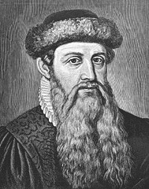

# SILE and Markdown

```djot


> "Markdown is intended to be as easy-to-read and easy-to-write as is feasible."
^ From the original [Markdown specification](https://daringfireball.net/projects/markdown/syntax).
```

[M]{custom-style=Initial}[arkdown]{.smallcaps}, as initially designed, was quite simple, and it quickly became a landmark for documentation, especially technical.
Several variants emerged, extending the original set of features.
Amongst other solutions, the Pandoc converter started supporting a nice set of interesting extensions for lists, footnotes, tables, etc.^[See [IETF RFC 7764, section 3.3](https://datatracker.ietf.org/doc/html/rfc7764#section-3.3).]
--- So that nowadays, Markdown, enriched with these extensions, may be quite appealing to writers and authors alike.

Within SILE’s aim to produce beautiful printed documents, it's a pretty reasonable assumption that such writers and authors may want to use this fine typesetter with their Markdown content, without having to learn the SIL language and its specifics (but not, either, fully excluding it for some advanced capabilities).

Guess what, the very chapter you are currently reading now is written in Markdown.
However, even with all its extensions, Markdown is less versatile than Djot, and is sometimes ambiguous.
In this chapter, we will go through the supported syntax, repeating most of the topics covered in the previous chapter.
The idea is that it can be read independently, and yet highlight the important differences between the two languages.

[comment]: # (THIS TEXT SHOULD NOT APPEAR IN THE OUTPUT. It is actually the most platform independent comment in Markdown.)

## Core concepts

The core concepts are basically the same as in Djot.
However, the original Markdown syntax was quite limited.

This converter enables several Pandoc-like extensions by default, and the following sections assume it is the case.

Nevertheless, note that you can disable most of the extensions if needed, see §[](#markdown-configuration).

## Attributes

Attributes are put inside curly braces:

  - `#foo` specifies an identifier, for referencing purposes.

    An element may have only one identifier; if multiple identifiers are given, the last one is used.

  - `.foo` specifies a class, for styling purposes.

    Multiple classes may be given in this way; they will be combined.

  - `key="value"`, `key='value'` or `key=value` specifies a key-value attribute.

    The value may be double-quoted, single-quoted, or unquoted.
    Quotes are needed when the value contains spaces or quotes.

    The key must start with a letter, followed by alphanumeric characters or any of `_`, `-`, `:` and `.` characters.

Attributes are only supported on a few inline elements.
On these inline elements, attributes are placed immediately after the element they are attached to, with no intervening whitespace.
Attributes must fit on one line, and there can be no more than one set of attributes per element:

 - Spans
 - Images and links (at this point, direct syntax only)


There are also only supported on a few block-level elements.
The syntax and the restrictions are the same as for inline elements.
On these block elements, attributes are placed _after_ the element they are attached to, possibly with intervening spaces:

 - Headings
 - Divs
 - Code blocks

::: {custom-style=Difference}
{height=1.3ex} **Main differences with Djot**

 - Slightly different syntax.
 - Supported on less elements.
 - No conditionals (Djot extension)

:::

## Inline elements

### Spaces

Markdown treats multiple spaces as a single space.

::: {custom-style=Difference}
{height=1.3ex} **Main differences with Djot**

Backslash-escaped spaces are not interpreted as non-breaking spaces.
To obtain a non-breaking space, the alternative is to use the HTML entity `&nbsp;` (see §[](#markdown-html-elements)).
This converter interprets it as a justifiable interword-space.
:::

### Line breaks

Line breaks in inline content are treated as “soft” breaks.
In other words, this converter semantically interprets them as mere spaces.

To get a hard line break, use a backslash at the end of a line. Hard line breaks...\
... are supported.

::: {custom-style=CodeBlock}
```
Hard line breaks...\
... are supported.
```
:::


::: {custom-style=Difference}
{height=1.3ex} **Main differences with Djot**

Markdown also supports using two trailing spaces at the end of a line to create a hard line break.
While this syntax comes from the original Markdown specification, it is not recommended to use it, as these spaces are "invisible" and may be easily lost in the editing process.
:::

### Smart punctuation

The converter comes by default with smart typography enabled.

#### Dashes and ellipsis

Three dashes (`---`) in an inline text sequence are converted to an em-dash (---), two dashes (`--`) to an en-dash useful for ranges (ex., "it's at pages 12--14"), and three dots
(`...`) to an ellipsis (...).

#### Smart quotes

Smart quotes and apostrophes are also automatically handled.
Straight double quotes (`"`) and single quotes (`'`) are converted into appropriate quotes.

This converter takes into account the current language when converting straight double and single quotation marks to the appropriate typographic variant.

::: {custom-style=Difference}
{height=1.3ex} **Main differences with Djot**

The smart quotes feature is less robust than in Djot, and may sometimes be defeated (producing the wrong quotes).
In some documents, it may be better to disable it (see §[](#markdown-configuration)).

You may then need to enter the actual typographic quotes directly, using the appropriate Unicode characters.
:::

### Emphasis

Regular _emphasis_ is delimited by `_` or `*` characters.
Strong **emphasis** is delimited by `__` or `**` characters.

Emphasis can be nested.
For regular emphasis, this is interpreted as per usual typography conventions, adequately switching between italics and upright fonts.
_This is _an emphasis inside_ an emphasis._

::: {custom-style=CodeBlock}
```
_This is _an emphasis inside_ an emphasis._
```
:::

::: {custom-style=Difference}
{height=1.3ex} **Main differences with Djot**

 - Slightly different syntax.
 - Edge cases are handled differently.

:::

### Deletions

To mark it as deleted, enclose your content between `~~` delimiters.

Thus, ~~deletion~~ is `~~deletion~~`

For this converter, this is equivalent to a span with a `.strike` pseudo-class respectively (see §[](#markdown-spans) for details and styling).

::: {custom-style=Difference}
{height=1.3ex} **Main differences with Djot**

 - Different syntax and interpretation.
 - No direct support for "insertions"

:::

### Highlighted content

Inline content between `== and ==` is treated as highlighted (or "marked").

You thus get an ==highlight== with `==highlight==`

For this converter, this is equivalent to a span with a `.mark` pseudo-class (see §[](#markdown-spans) for details and styling).

::: {custom-style=Difference}
{height=1.3ex} **Main differences with Djot**

 - Different syntax.

:::

### Superscripts & subscripts

Superscript is delimited by `^` characters, subscript by `~`.
Thus, H~2~O is a liquid, and 2^10^ is 1024.

::: {custom-style=CodeBlock}
```
Thus, H~2~O is a liquid, and 2^10^ is 1024.
```
:::

This converter assumes that the content of a superscript or subscript consists of text, as it tries to use font features or text scaling techniques to render it.

::: {custom-style=Difference}
{height=1.3ex} **Main differences with Djot**

 - No attribute support on these elements.

:::


### Generic inline containers (spans) {#markdown-spans}

Text in square brackets that is not a link or image and is followed immediately by an attribute is treated as a generic span.

This converter recognizes a few specific attributes on spans:

 - Identifiers for referencing purposes
 - The `custom-style` attribute, see §[](#markdown-custom-styles)
 - The `lang` attribute, see §[](#markdown-language-changes)

#### Basic styling

This converter also recognizes the following pseudo-classes on spans:

 - [Small Caps]{.smallcaps}, as `[Small Caps]{.smallcaps}`
 - [underlines]{.underline} with `[underlines]{.underline}`
 - [struck out]{.strike} with `[struck out]{.strike}`
 - [insertions]{.inserted} with `[insertions]{.inserted}`
 - [deletions]{.deleted} with `[deletions]{.deleted}`
 - [highlighted]{.mark} with `[highlighted]{.mark}`

The last one is equivalent to the `==...==` syntax, and the third one is equivalent to the `~~...~~` syntax.
In other term, these Markdown inline elements are mere shortcuts for the corresponding spans.

Moreover, if used within in a **resilient** class, the converter uses the `md-underline`, `md-strikethrough`, `md-insertion`, `md-deletion` and `md-mark` styles for the last five spans, if they are defined in your style file.
Another way to put it is that the converter then does the same thing as a `{custom-style="..."}` attribute (see §[](#markdown-custom-styles)).
You can style and fine-tune these elements as you wish, and even use them for other purposes than their original intent.

#### Smarter typography

On spans, the `.decimal` pseudo-class attribute instructs the converter to consider numbers in the content as decimal numbers, formatted with suitable decimal mark and digit grouping according to the usage in the current language.
This allows, say, 1984 to be rendered as "[1984]{.decimal} years ago" in English, or "[1984 années]{.decimal lang=fr}" in French, with appropriate separators.

::: {custom-style=CodeBlock}
```
... rendered as "[1984]{.decimal} years ago" in English,
or "[1984 années]{.decimal lang=fr}" in French ...
```
:::

The `.nobreak` pseudo-class attribute ensures that line-breaking will not be applied there.
Use it wisely around small pieces of text, or you might end up with more serious justification issues!
Yet, it might be useful for proper names, etc.

When smart typography is enabled, the native converter also supports automatically converting straight single and double quotes after digits to single and double primes.
It can be useful for easily typesetting units (e.g. 6") or coordinates (e.g. Oxford is located at 51° 45' 7" N, 1° 15' 27" W).

::: {custom-style=CodeBlock}
```
Oxford is located at 51° 45' 7" N, 1° 15' 27" W
```
:::


::: {custom-style=Difference}
{height=1.3ex} **Main differences with Djot**

 - Prime conversion is specific to this Markdown converter.

:::

### Images {#markdown-images}

Here is an image: {width=1.5cm}

::: {custom-style=CodeBlock}
```
Here is an image: {width=1.5cm}
```
:::

Attributes are optional, and are passed through to the underlying SILE package.
You can notably specify the required image width and/or height, as done just above, by appending the `{width=... height=...}` attributes --- Note that any unit system supported by SILE is accepted, as well as percentages (see §[](#final-notes-units)).

::: {custom-style=Difference}
{height=1.3ex} **Main differences with Djot**

 - The "indirect" syntax is supported too, but does not support attributes (yet), so it is probably not very useful at this point.

:::

#### Implicit captioned figures

An image with nonempty caption, occurring alone by itself in a paragraph, will be rendered as a figure with a caption, as actually seen above.
Otherwise, the caption is ignored.

{#markdown-gutenberg width=3cm}

::: {custom-style=CodeBlock}
```
{width=3cm}
```
:::

As with Djot, it relies on the presence of a `captioned-figure` environment in your document class or previously loaded packages.

Specifically, if the **resilient** book class is used, the caption is numbered by default, and added to the list of figures. Specify `.unnumbered`, and `.notoc` respectively, if you do not want it.

#### Extended image types

Besides regular image files, a few specific file extensions are also recognized and processed appropriately by this converter.
Notably {height="1.3ex"} SVG is supported too (`.svg`), as demonstrated.
This inline "manicule" is obtained with:

::: {custom-style=CodeBlock}
```
... {height="1.3ex"} is supported ...
```
:::

Files in Graphviz DOT graph language (`.dot`) are supported and rendered as images, when the **embedders.sile** collection is properly configured.

{width="90%"}

This image is obtained with the following syntax.

::: {custom-style=CodeBlock}
```
{width="90%"}
```
:::

CSV files are also supported, when the **piecharts.sile** optional collection is properly installed (see §[](#recommended-additional-packages)), and are rendered as pie charts.

{height="8em" cutoff="0.07"}

This chart is obtained with the following syntax.

::: {custom-style=CodeBlock}
```
{height="8em" cutoff="0.07"}
```
:::


### Links and cross-references

Here is a link to [the SILE website](https://sile-typesetter.org/), and here is an internal link to the "[Images](#djot-image)" section.

::: {custom-style=CodeBlock}
```
... a link to [the SILE website](https://sile-typesetter.org/)
... an internal link to the "[Images](#djot-image)" section.
```
:::

As seen in the example, links can be local (referring to an identifier) or external (for instance, referring to a URL).

You can use attributes on links:
the [SILE website](https://sile-typesetter.org/){.underline}.[^markdown-link-attributes]

::: {custom-style=CodeBlock}
```
... the [SILE website](https://sile-typesetter.org/){.underline}.
```
:::

[^markdown-link-attributes]: Within a **resilient** class, we'd possibly rather recommend using a style to color links, etc.

There are actually two kinds of links, inline links and reference links.
Both start with the link text (which may contain arbitrary inline formatting) inside `[`...`]` delimiters.

Inline links then contain the link destination (URL) in parentheses, as shown above.
There should be no space between the `]` at the end of the link text and the open `(` defining the link destination.

Reference links use a reference label in square brackets, instead of a destination in parentheses.
This is another link to [the SILE website][sile].

::: {custom-style=CodeBlock}
```
Another link to [the SILE website][sile].
...
[sile]: https://sile-typesetter.org/
```
:::

[sile]: https://sile-typesetter.org/

The reference label should be defined somewhere in the document.
If the label is empty, then the link text will be taken to be the reference label as well as the link text.

::: {custom-style=Difference}
{height=1.3ex} **Main differences with Djot**

 - The "indirect" syntax does not support attributes (yet).

:::

#### Cross-references {#markdown-cross-references}

Markdown does not define a proper way to insert cross-references of the kind you would see in a book, as in the following example.

> The section on "[](#markdown-tables){.title}",
> that is [](#markdown-tables){.section},
> is on page [](#markdown-tables){.page}.

This converter takes a bold decision, though unlikely to break anything unexpected.
Empty local links (that is, without inline display content) are interpreted as cross-references.
By default, they are resolved to the closest numbering item, whatever that might be in the hierarchical structure of your document.
A pseudo-class attribute may be used to override the default behavior and specify which type
of reference is expected (page number, section number or title text).
Thus, the above example was obtained from the following input:

::: {custom-style=CodeBlock}
```
The section on "[](#markdown-tables){.title}",
that is [](#markdown-tables){.section},
is on page [](#markdown-tables){.page}.
```
:::

Besides heading levels, it also works for various elements where you can define an identifier.
For instance we had some centered text in section [](#markdown-centered).
With appropriate class and package support,[^markdown-sec-label-support] you may even refer to Gutenberg as "figure [](#markdown-gutenberg)", or to some poetry verse mentioning the Sun ("Soleil"), in [](#sun){.section}, as "verse [](#sun)".

[^markdown-sec-label-support]: Typically, it works with the **resilient** collection of classes and packages. It won't work with non-supporting class and packages, using the fallback implementation for captioned elements, poetry, etc.

#### Automatic links

A URL or email address that is enclosed in angle brackets (`<`...`>`) is rendered as a link.
The content between pointy braces is treated literally (backslash-escapes may not be used).

Here is a link to the SILE website, <https://sile-typesetter.org/>.

::: {custom-style=CodeBlock}
```
... to the SILE website, <https://sile-typesetter.org/>.
```
:::


Verbatim content begins with a string of consecutive backtick characters (`` ` ``) and ends with an equal-lengthed string of consecutive backtick characters.
This is mostly used for `code` --- obtained with `` `code` `` (enjoy the inception).

Material between the backticks is treated as verbatim text (backslash escapes don't work there).

### Maths

To include TeX-like math, put the math between `$` (for inline math) or `$$` (for display math).
For instance, the following code produces $e^{i\pi}=-1$.

::: {custom-style=CodeBlock}
```
... the following code produces $e^{i\pi}=-1$.
```
:::

There is an important constraint, though: you have to restrict yourself to the syntax subset supported by SILE. This being said, some nice formula may be achieved.
$$\pi=\sum_{k=0}^\infty\frac{1}{16^k}(\frac{4}{8k+1} − \frac{2}{8k+4} − \frac{1}{8k+5} − \frac{1}{8k+6})$$


::: {custom-style=CodeBlock}
```
... may be achieved.
$$\pi=\sum_{k=0}^\infty\frac{1}{16^k}(\frac{4}{8k+1} − \frac{2}{8k+4} − \frac{1}{8k+5} − \frac{1}{8k+6})$$
```
:::

::: {custom-style=Difference}
{height=1.3ex} **Main differences with Djot**

 - Different syntax (delimiters).
 - Sometimes ambiguous, although the converter tries to be smart about it.
   (Note that $20,000 and $30,000 don't parse as math, while $e^{i\pi}=-1$ does.)

:::

### Footnote calls

A footnote call[^markdown-some-fn] is marked with `^` and the reference label in square brackets.
See §[](#markdown-footnotes) for the syntax of the footnote itself.

::: {custom-style=CodeBlock}
```
A footnote call[^markdown-some-fn] is marked...
```
:::

[^markdown-some-fn]: An example footnote.

Another Pandoc-inspired extension is the possibility to direct inline footnotes.
They are introduced with directly with the caret `^`, immediately followed by the footnote content in square brackets, as in the following example.^[Direct footnote.]

::: {custom-style=CodeBlock}
```
... the following example.^[Direct footnote.]
```
:::

::: {custom-style=Difference}
{height=1.3ex} **Main differences with Djot**

 - Direct inline footnotes are not supported in Djot.

:::

### Symbols

::: {custom-style=Difference}
{height=1.3ex} **Main differences with Djot**

  - No support for symbols in Markdown.

:::

### Raw inlines {#markdown-raw-inlines}

Raw inline content in any format may be included using a verbatim span followed by `{=format}`.
This content is intended to be passed through verbatim when rendering the designated format, but ignored otherwise.

This converter supports a `{=sile}` annotation, to pass through its content in SIL language. Let's do something fun`\dotfill`{=sile}!

::: {custom-style=CodeBlock}
```
Let's do something fun`\dotfill`{=sile}!
```
:::

It also supports `{=sile-lua}` to pass Lua code. Let's try it here
`SILE.call("hrule", {height="1ex", width="1ex"})`{=sile-lua}

::: {custom-style=CodeBlock}
```
Let's try it here
`SILE.call("hrule", {height="1ex", width="1ex"})`{=sile-lua}
```
:::

### HTML elements {#markdown-html-elements}

For mere convenience, the `<br>` element is supported in addition to the standard ways to indicate a hard line break.
Therefore...<br>... it is honored.

Would you have a long word, such as AAAAA<wbr>BBBBB<wbr>CCCCC<wbr>DDDDD<wbr>EEEEE<wbr>FFFFF<wbr>GGGGG<wbr>HHHHH<wbr>IIIII<wbr>JJJJJ<wbr>KKKKK<wbr>LLLLL<wbr>MMMM, the `<wbr>` element (introduced in HTML5) represents a word break opportunity.
It may help when the line-breaking rules would not otherwise create a break at acceptable locations.
In this admittedly lame example, we used it between groups of a same letter.

HTML entities are also processed, e.g. `&permil;` renders as &permil;.

::: {custom-style=Difference}
{height=1.3ex} **Main differences with Djot**

 - HTML elements and entities are not supported in Djot.

:::

## Block elements

### Paragraphs

A paragraph is a sequence of non-blank lines that does not meet the condition for being one of the other block-level elements.

A paragraph ends with a blank line or the end of the document.
The textual content is parsed as a sequence of inline elements.
A single newline is treated as a space.

### Headings

A heading starts with a sequence of one or more `#` characters, followed by whitespace.
The number of `#` characters defines the heading level.
The heading text following that sequence is parsed as inline content.

For example, this very section is a level three heading.
It was therefore obtained with:

::: {custom-style=CodeBlock}
```
### Headings
```
:::

This converter accepts the following pseudo-classes on heading attributes:

 - `.unnumbered` suppresses numbering of the heading.
 - `.notoc` suppresses the heading from appearing in the table of contents.

The heading attributes, obviously, also accept an identifier, for referencing purposes.
Here is an example illustrating the use of these attributes:

::: {custom-style=CodeBlock}
```
#### Other attributes {#markdown-unnumbered-heading .unnumbered .notoc}

```
:::

::: {custom-style=Difference}
{height=1.3ex} **Main differences with Djot**

 - Attributes come after the heading text, not on a separate line before it.
 - The heading text must be on the same line as the `#` characters.

:::

#### Other attributes {#markdown-unnumbered-heading .unnumbered .notoc}

Other attributes are passed through to the underlying heading implementation, which might do something with them.[^markdown-heading-level-mapping]

[^markdown-heading-level-mapping]: The converter assumes it can map heading levels to SILE commands `part`, `chapter`, `section`, `subsection`, `subsubsection`.
It uses a very basic fallback if these are not found (or if the sectioning level gets past that point).
The implication, therefore, is that the document class or other packages have to provide the relevant implementations.
Also note that parts are supported by the **resilient** book class as a level 0 heading, and are therefore only available when header shifting is applied (see §[](#markdown-configuration)).


#### Alternative syntax

The above syntax (known as "ATX headings") is generally preferred, but the "Setext" syntax is also supported, for compatibility with other Markdown implementations.
It does not support more than two levels of headings.
It consists of a line of `=` or `-` characters under the heading text, for level 1 and 2 headings, respectively.

::: {custom-style=Difference}
{height=1.3ex} **Main differences with Djot**

 - The "Setext" syntax is not supported in Djot.

:::

### Block quotes

A block quote is a sequence of lines, each of which begins with `>`, followed either by a space or by the end of the line.
The contents of the block quote are parsed as block-level content.

::: {custom-style=CodeBlock}
```
> This is block quote.
>
> > Such quotes can be nested.
```
:::

> This is block quote.
>
> > Such quotes can be nested.

If your document class or previously loaded packages provide a `blockquote` environment, it will be used.
Otherwise, the converter uses its own fallback method, with hard-coded styling.

::: {custom-style=Difference}
{height=1.3ex} **Main differences with Djot**

 - Attributed quotes (epigraphs) are not supported.

:::

### Lists

A list item consists of a list marker followed by a space (or a newline) followed by one or more lines, indented relative to the list marker.

::: {custom-style=CodeBlock}
```
1. Nesting...
 
    ... works as intended.
 
     - Fruits
        - Apple
```
:::


 1. Nesting...

    ... works as intended.

     - Fruits
        - Apple


#### Unordered lists

Unordered lists (a.k.a. itemized or bulleted lists) are introduced by a bullet list marker, either `-`, `+`, or `*`.
With this converter, the list marker is not significant, and the supporting package is responsible for rendering nested lists with the appropriate symbol.

::: {custom-style=CodeBlock}
```
 - This is a bullet list.
    - It can be nested.
```
:::

 - This is a bullet list.
    - It can be nested.

::: {custom-style=Difference}
{height=1.3ex} **Main differences with Djot**

 - Subtle differences regarding how spaces are handled.
 - Djot is stricter on where it expects blank lines.

:::

#### Ordered lists

Markdown supports several types of ordered lists.

Supported types of ordered lists are:

  - Decimal-enumerated, followed by period.
  - Decimal-enumerated, followed by parenthesis.
  - Lower-alpha-enumerated, followed by period.
  - Lower-alpha-enumerated, followed by parenthesis.
  - Upper-alpha-enumerated, followed by period.
  - Upper-alpha-enumerated, followed by parenthesis.
  - Lower-roman-enumerated, followed by period.
  - Lower-roman-enumerated, followed by parenthesis.
  - Upper-roman-enumerated, followed by period.
  - Upper-roman-enumerated, followed by parenthesis.

Using a hash (`#`) instead of a digit for an ordered list enumerator is also supported (equivalent to `1`).

In a given type of list, you do not have to number the items in order by yourself, as Markdown automatically increments the number for you.
Your starting number, however, is honored, would you want to start at a different number than 1 (in any numbering scheme).

::: {custom-style=CodeBlock}
```
1. Item
1. Item
1. Item
```
:::

1. Item
1. Item
1. Item

::: {custom-style=CodeBlock}
```
 b. This list starts at "b"
 
     iii) This list starts a "iii" in roman numerals.
     i) Next item is thus "iv".
 
 a. The next item here is "c".
```
:::

  b. This list starts at "b"

      iii) This list starts a "iii" in roman numerals.
      i) Next item is thus "iv".

  a. The next item here is "c".


::: {custom-style=Difference}
{height=1.3ex} **Main differences with Djot**

 - The hash enumerator is specific to Markdown, with no equivalent in Djot.
 - Numbering schemes enclosed in parentheses are not (yet) supported

:::

#### Definition lists

To create a definition list, type the term on the first line.
On the next line, after optional spaces, type a colon `:` followed by a space and the definition.

::: {custom-style=CodeBlock}
```
apples
  : Good for making applesauce.

citrus
  : Like oranges but yellow.
```
:::


apples
  : Good for making applesauce.

citrus
  : Like oranges but yellow.


::: {custom-style=Difference}
{height=1.3ex} **Main differences with Djot**

 - Different syntax.
 - No support for attributes on definition lists.
 - Ambiguous and messy syntax, _really._ And don't get this author started on how to have multiple paragraphs in a definition in a robust way...

:::

#### Task lists

A bullet list item that begins with `[ ]`, `[X]`, or `[x]` followed by a space is a task list item, either unchecked (`[ ]`) or checked (`[X]` or `[x]`).

::: {custom-style=CodeBlock}
```
 - [ ] Unchecked item
 - [x] Checked item
```
:::

 - [ ] Unchecked item
 - [x] Checked item


### Footnote references {#markdown-footnotes}

This is a regular footnote.[^markdown-fnt]

[^markdown-fnt]: This is a regular footnote.

::: {custom-style=CodeBlock}
```
... a regular footnote.[^markdown-fnt]
 
[^markdown-fnt]: This is a regular footnote.
```
:::

::: {custom-style=Difference}
{height=1.3ex} **Main differences with Djot**

 - No support for attributes on footnotes references.
 - Hence,
    - No custom footnote markers,
    - No linkable footnotes from the flow of the text.

:::

### Tables {#markdown-tables}

Markdown supports the "pipe table" syntax, with its own way for marking the optional caption.

| Right | Left | Default | Center |
|------:|:-----|---------|:------:|
|  12   |  12  |    12   |    12  |
|  123  |  123 |   123   |   123  |

  : Demonstration of a pipe table.

::: {custom-style=CodeBlock}
```
| Right | Left | Default | Center |
|------:|:-----|---------|:------:|
|  12   |  12  |    12   |    12  |
|  123  |  123 |   123   |   123  |
 
  : Demonstration of a pipe table.
```
:::

When using the **resilient** classes, the caption will be numbered by default, and added to the list of tables.

::: {custom-style=Difference}
{height=1.3ex} **Main differences with Djot**

 - Different syntax for introducing the caption.
 - No support for table attributes.

:::

### Code blocks

A code block is enclosed in a "fence," starting with a line of three or more consecutive backticks and ending with a line of backticks equal in length to the opening line.
The opening line may contain a format string, which is passed through to the converter.
In this version, this is equivalent to specifying a pseudo-class attribute in a block attribute.
(So a `xxx` format string after the opening fence and a `.xxx` class specifier in a block attribute are currently equivalent.)

The content of the code block is passed through to the converter, which is responsible for interpreting it.
In most cases, the content is rendered as verbatim text, with some exceptions detailed below, for "recognized" formats.

Erm... Markdown supports yet another syntax for loosely defined verbatim code blocks, which is the "indented code block" syntax.
This author would rather not recommend using it, and frow upon the  indentation ambiguities it introduces in some cases.

::: {custom-style=CodeBlock}
    This is an indented code block.
:::

This is obtained by indenting the content by at least four spaces...

::: {custom-style=CodeBlock}
```
    This is an indented code block.
```
:::

::: {custom-style=Difference}
{height=1.3ex} **Main differences with Djot**

 - Different syntax for introducing the format string.
 - Block attributes go after the opening fence (instead of the format string), not before it.
 - No support for attributes on code blocks.
 - Indented code blocks are Markdown-specific, ugly and ambiguous...

:::

#### Lua code blocks

Code blocks marked as being in the Lua language are rendered as verbatim text, with syntax highlighting.
For instance, the following code block...

::: {custom-style=CodeBlock}
````
```lua
function fib (n)
  -- Fibonacci numbers
  if n < 2 then return 1 end
  return fib(n - 2) + fib(n - 1)
end
```
````
:::

... is rendered as:

::: {custom-style=CodeBlock}
```lua
function fib (n)
  -- Fibonacci numbers
  if n < 2 then return 1 end
  return fib(n - 2) + fib(n - 1)
end
```
:::

This is a very naive approach to syntax-highlighting, until the converter possibly supports a more general solution.

#### Rendered code blocks

If the converter knows how to render the content of a code block, it will do so by default.
The `render` attribute can be set to `false` to prevent this behavior, and enforce the content to be rendered as raw verbatim text.

**Mardown and Djot code blocks**

Code blocks marked as being in Markdown or Djot are interpreted.

For Markdown, attributes are passed to the converter, allowing to possibly use different compatibility options (for Markdown especially, see §[](#markdown-configuration)).
This feature allows switching between those languages, would there be something one does not support yet.

Our Djot extended implementation, for instance, supports attributed quotes (or epigraphs).
This chapter being written in Markdown, let's switch to Djot and type such a quote...

```djot
{rule="0.4pt"}
> It is a good thing for an uneducated man to read books
> of quotations.
^ Winston Churchill.
```

This was obtained with:

:::: {custom-style=CodeBlock}
````
```djot
{rule="0.4pt"}
> It is a good thing for an uneducated man to read books
> of quotations.
^ Winston Churchill.
```
````
::::

**Other rendered code blocks**

Other formats may be recognized, provided the converter knows how to handle them.
Internally, this relies on two extensible mechanisms:

 - SILE "raw" handlers, which may be declared by other packages.*
 - Renderers for text formats that can be converted to an image, as supported by the **embedders.sile** module, provided the necessary software is installed on your host system. (See §[](#recommended-additional-software) for more details.)

**Graphviz DOT graphs**

Thus, if you properly installed the **embedders.sile** collection and its software dependencies, then code blocks marked as being in the Graphviz DOT language are rendered as images.
Attributes are passed to the underlying processor.
For instance, the image below is produced with `{.dot width="5cm" layout=neato}`.

``` {.dot width="5cm" layout=neato}
graph {
  node [fillcolor="lightskyblue:darkcyan" style=filled gradientangle=270]
  a -- { b d };
  b -- { c e };
  c -- { f g h i };
  e -- { j k l m n o };
}
```

The original DOT description used in the code block is shown hereafter.

::: {custom-style=CodeBlock}
```{.dot render=false width="5cm" layout=neato}
graph {
  node [fillcolor="lightskyblue:darkcyan" style=filled
        gradientangle=270]
  a -- { b d };
  b -- { c e };
  c -- { f g h i };
  e -- { j k l m n o };
}
```
:::

**Pie charts**

Likewise, if you installed the optional **piecharts.sile** collection, then code blocks marked as "piechart" are automatically rendered, with all other attributes are passed to the underlying processor.
Consider the following code block, consisting in a CSV table...

::: {custom-style=CodeBlock}
````
``` {.piechart height=8em}
Player,Score
Mario,55
Luigi,23
Peach,12
Bowser,10
```
````
:::

... then, provided a proper setup, it is rendered as:

``` {.piechart height=8em}
Player,Score
Mario,55
Luigi,23
Peach,12
Bowser,10
```

### Content container divisions (divs)

A div begins with a line of three or more consecutive colons, optionally followed by white space and either a class name or attributes. It ends with a line of consecutive colons at least as long as the opening fence, or with the end of the document or containing block.

This converter recognizes a few specific attributes on divs:

 - Identifiers for referencing purposes
 - The `custom-style` attribute, see §[](#djot-custom-styles)
 - The `lang` attribute, see §[](#djot-language-changes)

::: {custom-style=Difference}
{height=1.3ex} **Main differences with Djot**

 - Different syntax for introducing the class name or attributes.
 - No support for divs with a caption (Djot extension)

:::

### Horizontal dividers

In standard Markdown, a line containing a row of three or more asterisks, dashes, or underscores (optionally separated by spaces) are supposed to produce a horizontal rule. 
This converter however slightly deviates from that simple specification^[And also from Pandoc, therefore. Quite obviously, the `\autodoc:package{pandocast}`{=sile} package will also only show horizontal rules.],
for the mere reason that such a horizontal rule is seldom typographically sound in many contexts.

Three asterisks produce a centered asterism.

***

Three space-separated asterisks produce a "dinkus".

* * *

Three dashes produce a centered horizontal rule, taking 20% of the line.

---

Four dashes produce a centered horizontal rule, taking 33% of the line.

----

Four space-separated dashes produce, provided appropriate package support is available^[I.e. the **couyards.sile** package module is installed.], a nice curvy pendant.
What you see just below therefore depends on that support being present or not.

- - - -

Finally, without demonstrating it here, fourteen consecutive dashes enforce a page break.^[Why exactly fourteen?
"The original says _fourteen_, but there is ample reason to infer that, as used by Asterion, this numeral stands for _infinite_." (Jorge Luis [Borges]{.smallcaps}, "The House of Asterion".
In _Labyrinths: Selected Stories and Other Writings_, 1964.)]
It gives some flexibility to authors for marking a page break, and still get something visible in its place with other converters.

Otherwise, everything else produces a full rule.^[Since this feature may elvove and support more patterns, let's guarantee that underscores are reserved, and will always produce a full horizontal rule.
This author finds three or more underscores ugly and never used them inMarkdown; as of bad typography, it renders justice to the full rule.]

___

With all these variants at your disposal, you should be able to typeset print-quality
books and novels, with the appropriate dividers within chapters, or at the end of thereof.

::: {custom-style=Difference}
{height=1.3ex} **Main differences with Djot**

 - _Ad hoc_ interpretation of separators, so as to produce more typographically sound results despite not supporting attributes on horizontal rules.
 - Less flexibility than the class-based approach in Djot.

:::

### Raw blocks {#markdown-raw-blocks}

A code block marked as `=format` is interpreted as raw content and passed through verbatim to output in that format.
As for raw inlines (§[](#markdown-raw-inlines)), this converter supports the `{=sile}` and `{=sile-lua}` annotations.
Other annotations are ignored, and the block content is skipped.

Let's combine several of the extensibility techniques we have seen so far, and do something cool.

```{=sile}
\use[module=packages.barcodes.ean13]
```

```{=sile-lua}
local class = SILE.documentState.documentClass
class:registerCommand("MyEan13b", function (_, content)
  local code = SU.ast.contentToString(content)
  code = code:gsub("[-–]","")
  SILE.call("ean13", { scale="SC0", code = code })
end)
```

Why not "style" an EAN-13 ISBN as a nice barcode?

[[978-2-9539896-6-3]{custom-style=MyEan13b}]{custom-style=center}

First, we ensure the **barcodes.ean13** packages is loaded.[^markdown-ean13-assume]
Let's use some SIL language for that.

[^markdown-ean13-assume]: The package is part of the **barcodes.sile** collection, and is not installed by default --- But the **resilient.sile** collection does include it, and this is what we are using here.

::: {custom-style=CodeBlock}
````
```{=sile}
\use[module=packages.barcodes.ean13]
```
````
:::

Then, we define a new SILE command to render the EAN-13 barcode.
Let's do it in Lua, as we need some string manipulation.

::: {custom-style=CodeBlock}
````
```{=sile-lua}
local class = SILE.documentState.documentClass
class:registerCommand("MyEan13b", function (_, content)
  local code = SU.ast.contentToString(content)
  -- Remove dashes and (smart) en-dashes
  code = code:gsub("[-–]","")
  SILE.call("ean13", { scale="SC0", code = code })
end)
```
````
:::

We can now use our new command as a custom style (see §[](#markdown-custom-styles)).

::: {custom-style=CodeBlock}
```
... [978-2-9539896-6-3]{custom-style=MyEan13b}
```
:::

Other converters will likely ignore the style, and the ISBN will be displayed as-is, so this technique degrades gracefully.

::: {custom-style=Difference}
{height=1.3ex} **Main differences with Djot**

 - Curly braces around the `{=sile}` and `{=sile-lua}` annotations.

:::

### Line blocks

So called "line blocks", a sequence of lines beginning with a vertical bar (`|`) and followed by a space, are supported.
The division into lines is preserved in the output.
Any additional leading space is preserved too, interpreted as an em-quad. These blocks can be useful for typesetting addresses or poetry.

::: { custom-style=em }
| Long is one night, long is the
  next;
|  how can I bear three?
| A month has often seemed less to me
|  than this half night of longing.
:::

This implementation goes a bit beyond the standard Pandoc-inspired support for line blocks.
In particular, empty lines (i.e. starting with a vertical bar and a single space, but no other content afterwards) are interpreted as stanza separators, which should be smaller than an empty line (i.e. a small skip, by default).

::: { .poetry lang=fr step=4 }
| En hiver la terre pleure ;
| Le soleil froid, pâle et doux,
| Vient tard, et part de bonne heure,
| Ennuyé du rendez-vous.
| 
| Leurs idylles sont moroses.
| — [Soleil]{#sun} ! aimons ! — Essayons.
| Ô terre, où donc sont tes roses ?
| — Astre, où donc sont tes rayons ?
| 
| Il prend un prétexte, grêle,
| Vent, nuage noir ou blanc,
| Et dit : — C’est la nuit, ma belle ! —
| Et la fait en s’en allant ;
| 
| Comme un amant qui retire
| Chaque jour son cœur du nœud,
| Et, ne sachant plus que dire,
| S’en va le plus tôt qu’il peut.
:::

Moreover, there's once again a nice catch. If your class or previously loaded packages provide a `poetry` environment, and you set the `.poetry` class specifier on a "div" element just around the line blocks, then this environment will be used instead of the default one provided by the converter.
It is assumed to implement the same features and options ---namely, `numbering` (boolean, true by default)^[For consistency with headers, the `.unnumbered` class specifier is also supported.], `start` and `step`
(integers) and `first` (boolean, false by default) --- as the **resilient.poetry** 3rd-party package. For instance:

~~~
:::{ .poetry step=4 first=true }
| Some verses...
| Other verses...
:::
~~~

:::{custom-style=Difference}
{height=1.3ex} **Main differences with Djot**

 - Line blocks are not (yet) supported in Djot, and Mardown shines here.

:::

## Advanced topics {#markdown-advanced-topics}

### Languages {#markdown-language-changes}

Language changes within the text are supported, on either blocks or inline
elements.
It relies on the `lang` key-value attribute, where the value is a BCP47 language code.
It is not much visible below, obviously, but the language setting affects the hyphenation and other properties.
In the case of French, for instance, you can see the special thin space before the exclamation point, the use of appropriate quotation marks, and the internal spacing around quoted text:

::: {lang=fr}
> Cette citation est en français!
:::

Or inline in text: ["Encore du français!"]{lang=fr}

This was obtained with:

::: {custom-style=CodeBlock}
```
::: {lang=fr}
> Cette citation est en français!
:::
 
Or inline in text: ["Encore du français!"]{lang=fr}
```
:::

As can be seen, the current language is taken into account when converting
paired straight double and single quotation marks to the appropriate typographic variant:
["English"]{lang=en} / ["Deutsch"]{lang=de} / ["français"]{lang=fr} / ["dansk"]{lang=da} / ["русский"]{lang=ru};
['English']{lang=en} / ['Deutsch']{lang=de} / ['français']{lang=fr} / ['dansk']{lang=da} / ['русский']{lang=ru}.[^markdown-smart-quotes]

[^markdown-smart-quotes]: For most languages, `"` and `'` correspond to the primary and secondary quotations marks, respectively.
In some languages, they are used the other way round, but obviously the user's input is respected in those cases (e.g. respectively ["Ghàidhlig"]{lang=cy} and ['Ghàidhlig']{lang=cy}).

### Custom styles {#markdown-custom-styles}

The converter also supports the `{custom-style="..."}` attribute on divs and spans.
It is inspired by the syntax proposed by Pandoc for Markdown, in its **docx** writer, to specify a specific, possibly user-defined, custom style name (in that case, a Word style, obviously).

Here, if such a named style exists, it is applied. Erm. What does it mean?
Well, in the default implementation, if used within in a *resilient* class and there is a corresponding style, the converter uses it.
Otherwise, if there is a corresponding SILE command by that name, the converter invokes it.
Otherwise, it just ignores the style and processes the content as-is.
Even if you do not use a resilient-compatible class, it thus allows you to use some interesting SILE features.
For instance, here is some block of text marked as "center", with some inline text marked as "strong".

::: {#markdown-centered custom-style="center"}
This is SILE and Djot at their [best]{custom-style="strong"}!
:::

This was obtained with:

::: {custom-style="CodeBlock"}
```
::: {#markdown-centered custom-style="center"}
This is SILE and Djot at their [best]{custom-style="strong"}!
:::
```
:::

That's a fairly contrived way to obtain a bold text, but you get the underlying general idea.
This is one of the ways to use SILE commands in Djot.
While you could invoke _any_ SILE command with this feature, we recommend, though, to restrict it to styling.
Another more powerful way to leverage Djot with SILE’s full processing capabilities, and benefit from the best of both worlds, is to use the "raw" annotations, described in §[](#markdown-raw-inlines) and §[](#markdown-raw-blocks).


## Configuration {#markdown-configuration}

The calling context (a wrapper document in SIL syntax, a resilient "master document", etc.) can pass additional options to tune the behavior of the converter.

Any option starting with `meta:` is passed to the converter (with this prefix removed).
It converter cannot use these options -- Markdown does not support symbols as Djot does -- but at least they are passed through to any embedded Djot block, and might be used there.

The `shift_headings` option can take an integer value and causes headers in included or embedded raw content to be offset (that is, shifted by the given amount).

In SIL documents, you can pass such options to the `\include` command or the `raw` environment.
For instance, you can include a Markdown file with shifted headings like this:

::: {custom-style=CodeBlock}
```
\include[src=somefile.md, shift_headings=1]
```
:::

For document classes supporting it (in particular, the **resilient** book class), this feature also allows you to access levels above the default scheme, such as "parts".

::: {custom-style=CodeBlock}
```
\include[src=somefile.md, shift_headings=-1]
```
:::

Finally, most Markdown syntax extensions are enabled by default.
The calling context can pass additional options to tune the behavior of the Markdown parser.

:::: {custom-style=FramedPara}
::: {custom-style=raggedright}
Available options are: `smart`, `smart_primes`, `strikeout`, `mark`, `subscript`, `superscript`,
`definition_lists`, `notes`, `inline_notes`,
`fenced_code_blocks`, `fenced_code_attributes`, `bracketed_spans`, `fenced_divs`,
`raw_attribute`, `link_attributes`,
`startnum`, `fancy_lists`, `task_list`, `hash_enumerators`, `table_captions`, `pipe_tables`, `header_attributes`,
`line_blocks`, `escaped_line_breaks`, `tex_math_dollars`.
:::
::::

For instance, to disable the smart typography feature:

::: {custom-style=CodeBlock}
```
\include[src=somefile.md, smart=false]
```
:::
